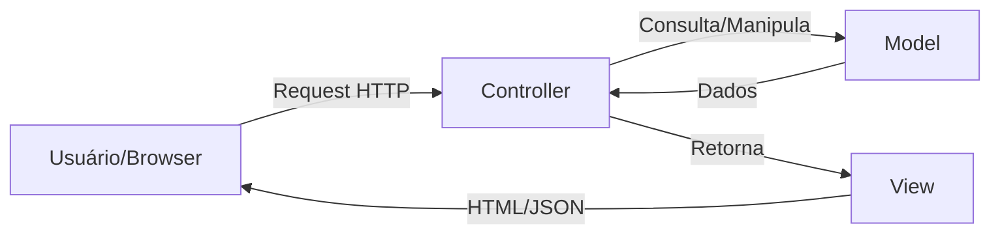
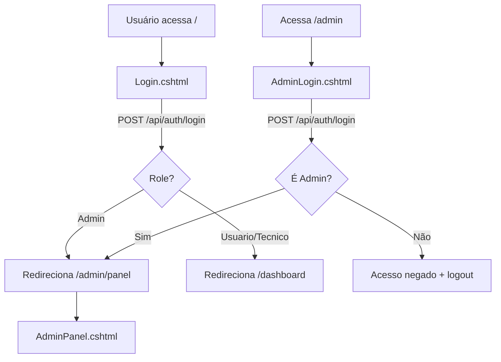

# 🎤 Guia de Apresentação — Ticket System (Parte 1)

---

## 1. Qual arquitetura foi utilizada e por quê?

### Arquitetura: **MVC (Model-View-Controller)**



**O que é MVC?**
- **Model** → Representa os dados e regras de negócio (`Ticket.cs`, `User.cs`, `TicketComment.cs`)
- **View** → Interface visual que o usuário vê (arquivos `.cshtml`)
- **Controller** → Recebe requisições, processa a lógica e devolve a resposta (`AuthController.cs`, `TicketController.cs`, `HomeController.cs`)

**Por que MVC?**
1. **Separação de responsabilidades** — cada camada cuida de uma coisa
2. **Manutenção facilitada** — posso alterar o front-end sem mexer nas regras de negócio
3. **Testabilidade** — Controllers e Models podem ser testados independentemente
4. **Padrão do ASP.NET Core** — o framework já vem preparado para MVC
5. **Escalabilidade** — permite crescer o projeto de forma organizada

**No código — [Program.cs](file:///c:/Users/danil/OneDrive/Área de Trabalho/Ticket-System/Program.cs):**
```csharp
// Linha 10 — registra o MVC no pipeline
builder.Services.AddControllersWithViews();

// Linhas 49-51 — configura a rota padrão MVC
app.MapControllerRoute(
    name: "default",
    pattern: "{controller=Home}/{action=Index}/{id?}");
```

> [!NOTE]
> O projeto também usa **Web API** (`[ApiController]`) dentro da mesma aplicação MVC, oferecendo endpoints REST (`/api/tickets`, `/api/auth`) consumidos via AJAX pelo front-end.

---

## 2. Arquivos e funções de Models, Views e Controllers

### 📁 Models (`/Models/`)

#### `Ticket.cs` — O Chamado
| Propriedade | Tipo | Descrição |
|---|---|---|
| `Id` | `Guid` | Identificador único |
| `Title` | `string` | Título do chamado |
| `Description` | `string` | Descrição do problema |
| `Sector` | `string` | Setor (TI, RH, etc.) |
| `Priority` | `string` | Prioridade (Baixa/Média/Alta) |
| `Status` | `TicketStatus` | Enum: Aberto, EmAndamento, Finalizado, Cancelado |
| `ImagePath` | `string?` | Caminho da imagem anexada |
| `CreatedAt` | `DateTime` | Data de criação |
| `StartedAt` | `DateTime?` | Data de início do atendimento |
| `FinishedAt` | `DateTime?` | Data de finalização |
| `ResolutionNotes` | `string?` | Solução ou motivo de cancelamento |
| `CreatedByUserId` | `Guid` | Quem criou |
| `StartedByUserId` | `Guid?` | Quem iniciou atendimento |
| `FinishedByUserId` | `Guid?` | Quem finalizou |
| `CancelledByUserId` | `Guid?` | Quem cancelou |

**Métodos de negócio:**
- `StartAttendance()` — Inicia atendimento (valida se pode iniciar)
- `FinishAttendance()` — Finaliza com solução (valida se está em andamento)
- `CancelTicket()` — Cancela com justificativa

#### `User.cs` — O Usuário
| Propriedade | Tipo | Descrição |
|---|---|---|
| `Id` | `Guid` | Identificador único |
| `Username` | `string` | Login do usuário |
| `PasswordHash` | `string` | Senha criptografada (SHA-256) |
| `DisplayName` | `string` | Nome de exibição |
| `Role` | `UserRole` | Enum: Usuario, Tecnico, Admin |
| `IsActive` | `bool` | Se o usuário está ativo |
| `CreatedAt` | `DateTime` | Data de criação |

#### `TicketComment.cs` — Comentários do Chamado
| Propriedade | Tipo | Descrição |
|---|---|---|
| `Id` | `Guid` | Identificador único |
| `TicketId` | `Guid` | Chamado relacionado |
| `UserId` | `Guid` | Quem comentou |
| `Content` | `string` | Texto do comentário |
| `ImagePath` | `string?` | Imagem anexada |
| `CreatedAt` | `DateTime` | Data do comentário |

---

### 📁 Controllers (`/Controllers/`)

#### `HomeController.cs` — Navegação de Páginas
Herda de `Controller` (MVC com Views).

| Método | Rota | O que faz |
|---|---|---|
| `Index()` | `/` | Renderiza a página de login |
| `Admin()` | `/admin` | Renderiza login do admin |
| `Dashboard()` | `/dashboard` | Renderiza o dashboard de tickets |
| `AdminPanel()` | `/admin/panel` | Renderiza o painel admin |
| `TicketDetail(Guid id)` | `/ticket/{id}` | Renderiza detalhes de um ticket |

#### `AuthController.cs` — API de Autenticação
Herda de `ControllerBase` (API REST pura). Rota base: `/api/auth`

| Método | Verbo + Rota | O que faz |
|---|---|---|
| `Login()` | `POST /api/auth/login` | Autentica usuário, cria sessão |
| `Logout()` | `POST /api/auth/logout` | Limpa sessão |
| `GetCurrentUser()` | `GET /api/auth/me` | Retorna usuário logado |
| `GetAllUsers()` | `GET /api/auth/users` | Lista todos (só Admin) |
| `CreateUser()` | `POST /api/auth/users` | Cria usuário (só Admin) |
| `ToggleUserActive()` | `PUT /api/auth/users/{id}/toggle-active` | Ativa/desativa (só Admin) |
| `UpdateUserRole()` | `PUT /api/auth/users/{id}/role` | Altera perfil (só Admin) |
| `DeleteUser()` | `DELETE /api/auth/users/{id}` | Remove usuário (só Admin) |
| `GetUserName()` | `GET /api/auth/users/{id}/name` | Busca nome pelo ID |

#### `TicketController.cs` — API de Chamados
Herda de `ControllerBase` (API REST). Rota base: `/api/tickets`

| Método | Verbo + Rota | O que faz |
|---|---|---|
| `CreateTicket()` | `POST /api/tickets` | Cria novo chamado (com imagem) |
| `GetAllTickets()` | `GET /api/tickets` | Lista chamados (filtro por role) |
| `GetTicketById()` | `GET /api/tickets/{id}` | Detalhe de um chamado |
| `StartAttendance()` | `PUT /api/tickets/{id}/start` | Inicia atendimento |
| `FinishAttendance()` | `PUT /api/tickets/{id}/finish` | Finaliza com solução |
| `CancelTicket()` | `PUT /api/tickets/{id}/cancel` | Cancela com justificativa |
| `GetComments()` | `GET /api/tickets/{id}/comments` | Lista comentários |
| `AddComment()` | `POST /api/tickets/{id}/comments` | Adiciona comentário |

---

### 📁 Views (`/Views/`)

| Arquivo | Descrição |
|---|---|
| `_ViewStart.cshtml` | Define que todas as Views usam o `_Layout` |
| `_ViewImports.cshtml` | Importa os TagHelpers do ASP.NET |
| `Shared/_Layout.cshtml` | Layout mestre: carrega Bootstrap, jQuery, Font Awesome, Google Fonts (Inter), CSS customizado |
| `Auth/Login.cshtml` | Tela de login do usuário comum |
| `Auth/AdminLogin.cshtml` | Tela de login exclusiva do admin |
| `Auth/AdminPanel.cshtml` | Painel de gestão de usuários (CRUD) |
| `Tickets/Index.cshtml` | Dashboard principal com tabela de chamados, filtros, cards de estatísticas, modais de criação/finalização/cancelamento |
| `Tickets/Detail.cshtml` | Detalhes de um chamado: timeline, discussão com comentários, ações |

---

## 3. Polimorfismo, Encapsulamento e Herança

### 🔒 Encapsulamento — **SIM, presente no projeto**

> Encapsulamento é o princípio de **esconder os detalhes internos** de uma classe, expondo apenas o que é necessário através de métodos públicos.

**Exemplo prático no `Ticket.cs`:**
```csharp
// As propriedades têm SET PRIVADO — só a própria classe pode alterá-las
public Guid Id { get; private set; }
public string Title { get; private set; } = string.Empty;
public TicketStatus Status { get; private set; }
public DateTime? StartedAt { get; private set; }
```

**Por que isso importa?** Ninguém de fora da classe pode fazer `ticket.Status = TicketStatus.Finalizado` diretamente. Para mudar o status, OBRIGATORIAMENTE precisa chamar os métodos de negócio que validam as regras:

```csharp
// Para iniciar — tem validação interna
public void StartAttendance(DateTime currentTime, Guid startedByUserId)
{
    if (Status == TicketStatus.Finalizado || Status == TicketStatus.Cancelado)
        throw new InvalidOperationException("Não é possível iniciar um chamado já finalizado.");
    
    Status = TicketStatus.EmAndamento;  // Só muda aqui dentro!
    StartedAt = currentTime;
}
```

> [!IMPORTANT]
> O `private set` é a materialização do encapsulamento. Os dados só podem ser modificados pelas regras internas da classe.

### 🧬 Herança — **SIM, presente no projeto**

> Herança é quando uma classe **herda propriedades e métodos** de outra classe pai.

**Exemplos no projeto:**

```csharp
// HomeController herda de Controller (MVC)
public class HomeController : Controller { }

// AuthController herda de ControllerBase (API)
public class AuthController : ControllerBase { }

// TicketController herda de ControllerBase (API)
public class TicketController : ControllerBase { }

// AppDbContext herda de DbContext (Entity Framework)
public class AppDbContext : DbContext { }
```

**O que ganham com herança?**
- `Controller` fornece métodos como `View()`, `RedirectToAction()`
- `ControllerBase` fornece `Ok()`, `NotFound()`, `BadRequest()`, `Unauthorized()`
- `DbContext` fornece `SaveChanges()`, `Set<T>()`, etc.

### 🔄 Polimorfismo — **Presente de forma implícita**

> Polimorfismo é a capacidade de **um mesmo método se comportar de formas diferentes** dependendo do contexto.

**Exemplos no projeto:**

1. **Sobrescrita (Override)** — `OnModelCreating` no `AppDbContext.cs`:
```csharp
// O método original existe em DbContext, e nós sobrescrevemos
protected override void OnModelCreating(ModelBuilder modelBuilder)
{
    base.OnModelCreating(modelBuilder);  // chama o pai
    // Adiciona nossas configurações customizadas
    modelBuilder.Entity<Ticket>(entity => { ... });
}
```

2. **Polimorfismo de subtipo** — O `HomeController` herda de `Controller` e o `AuthController` herda de `ControllerBase`. Ambos podem ser tratados como "controllers" pelo framework, mas cada um se comporta de forma diferente (um retorna Views HTML, outro retorna JSON).

---

## 4. Banco de Dados

### Qual banco é usado?
**PostgreSQL** — configurado em [appsettings.json](file:///c:/Users/danil/OneDrive/Área de Trabalho/Ticket-System/appsettings.json):
```json
"ConnectionStrings": {
    "DefaultConnection": "Host=localhost;Port=5432;Database=ticket_system_db;Username=postgres;Password=root"
}
```

### Como o banco roda?
O projeto usa **Entity Framework Core** com abordagem **Code-First**:
1. Você escreve as classes C# (Models)
2. O EF Core gera as tabelas automaticamente via **Migrations**
3. Na inicialização, o `Program.cs` aplica migrations automaticamente:

```csharp
// Program.cs — linhas 26-37
using (var scope = app.Services.CreateScope())
{
    var db = scope.ServiceProvider.GetRequiredService<AppDbContext>();
    db.Database.Migrate();  // Cria/atualiza o banco automaticamente!
}
```

### Posso abrir dentro e fora da IDE?

**SIM!** Três formas:

| Ferramenta | Dentro/Fora da IDE | Como usar |
|---|---|---|
| **pgAdmin 4** | Fora | Instala junto com PostgreSQL. Abra, conecte em `localhost:5432`, navegue até `ticket_system_db` |
| **DBeaver** | Fora | Ferramenta gratuita. Nova conexão → PostgreSQL → preencha host, porta, database, user, password |
| **VS Code + extensão** | Dentro | Instale a extensão "PostgreSQL" no VS Code e conecte |

### Como consultar o banco?
No **pgAdmin** ou **DBeaver**, abra uma janela SQL e rode:

```sql
-- Ver todos os usuários
SELECT * FROM "Users";

-- Ver todos os chamados
SELECT * FROM "Tickets";

-- Ver comentários
SELECT * FROM "TicketComments";

-- Chamados abertos com SLA
SELECT "Title", "Priority", "Status", "CreatedAt"
FROM "Tickets"
WHERE "Status" = 0;  -- 0 = Aberto
```

> [!TIP]
> No PostgreSQL os nomes das tabelas geradas pelo EF Core são case-sensitive, por isso precisam estar entre aspas duplas.

---

## 5. Como funciona o Views/Auth?

A pasta `Views/Auth/` contém **3 arquivos** que controlam todo o sistema de autenticação visual:

### Fluxo de Autenticação



### `Login.cshtml` — Login do Usuário Comum
- Formulário com campos **Usuário** e **Senha**
- Ao submeter, faz `POST /api/auth/login` via AJAX (jQuery)
- Se já estiver logado (`GET /api/auth/me` retorna sucesso), redireciona automaticamente
- Se o role for `Admin`, redireciona para `/admin/panel`; senão, para `/dashboard`
- Exibe mensagem de erro com animação `fadeIn`

### `AdminLogin.cshtml` — Login Exclusivo do Admin
- Visual diferenciado com badge "Painel Admin" e ícone de escudo
- Mesma API (`POST /api/auth/login`), mas **valida no front** se `role === 'Admin'`
- Se o usuário não for Admin, exibe "Acesso negado" e faz **logout automático** da sessão não-admin
- Link "Voltar ao login" para retornar à tela comum

### `AdminPanel.cshtml` — Painel de Gestão de Usuários
- Verificação de autenticação ao carregar (`checkAdmin()`)
- **CRUD completo de usuários:**
  - Formulário para adicionar usuário com Nome, Login, Senha e Perfil (Usuário/Técnico)
  - Lista todos os usuários com avatar, badges de role e status
  - Botões: Ativar/Desativar, Alterar Perfil (modal), Remover
- **Proteções:** Admin não pode ser desativado, removido ou ter role alterado
- Sistema de toast notifications para feedback visual

### Mecanismo de Sessão
A autenticação usa **Session** do ASP.NET (não JWT):
```csharp
// No login bem-sucedido (AuthController.cs)
HttpContext.Session.SetString("UserId", user.Id.ToString());
HttpContext.Session.SetString("Username", user.Username);
HttpContext.Session.SetString("DisplayName", user.DisplayName);
HttpContext.Session.SetString("Role", user.Role.ToString());
```

---

## 6. Vantagens do C# sobre PHP para este projeto

| Aspecto | C# (.NET) | PHP |
|---|---|---|
| **Tipagem** | Estática e forte — erros detectados em compilação | Dinâmica — erros só em runtime |
| **ORM** | Entity Framework Core — migrations automáticas, LINQ | Doctrine/Eloquent — menos integrado |
| **Performance** | Compilado (Kestrel) — muito rápido | Interpretado — mais lento |
| **POO** | Nativo e robusto: `private set`, `enum`, `Guid`, nullables | POO presente mas menos rigoroso |
| **Segurança de tipos** | `Guid`, `DateTime?`, `enum TicketStatus` — tudo tipado | Variáveis podem mudar de tipo |
| **Ferramentas** | Visual Studio, IntelliSense completo, debugger integrado | IDEs menos integradas |
| **Ecossistema** | NuGet com milhares de pacotes enterprise | Composer — mais voltado para web simples |
| **Arquitetura** | MVC nativo com DI (injeção de dependência) embutida | MVC via frameworks (Laravel) |
| **Escalabilidade** | Suporte nativo a async/await, middleware pipeline | Menos opções nativas |
| **Deployment** | Self-contained, Docker-friendly | Precisa de Apache/Nginx + PHP-FPM |

> [!IMPORTANT]
> **Ponto-chave para a apresentação:** O C# com ASP.NET Core permite que o **backend (API) e o frontend (Views/Razor)** coexistam no mesmo projeto de forma organizada. Em PHP, normalmente você precisaria de um framework como Laravel para conseguir a mesma organização.
